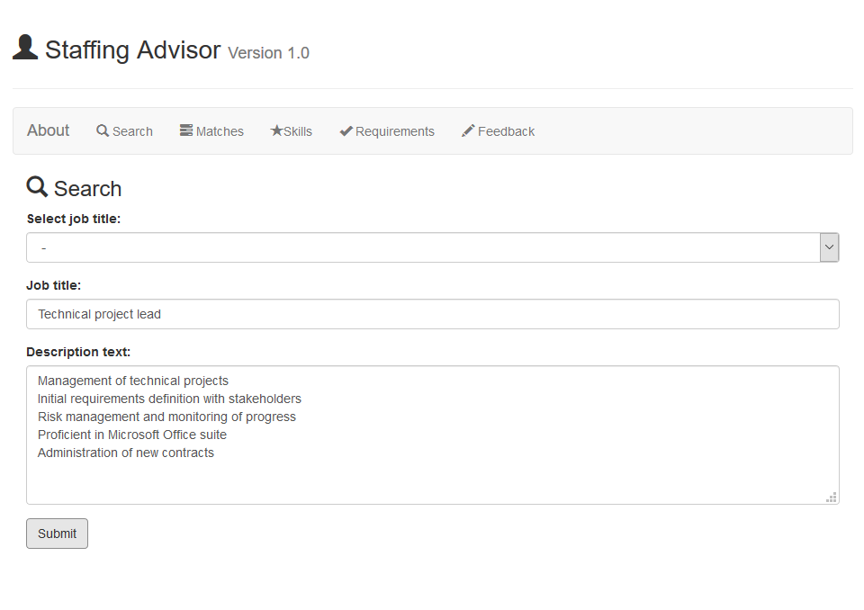
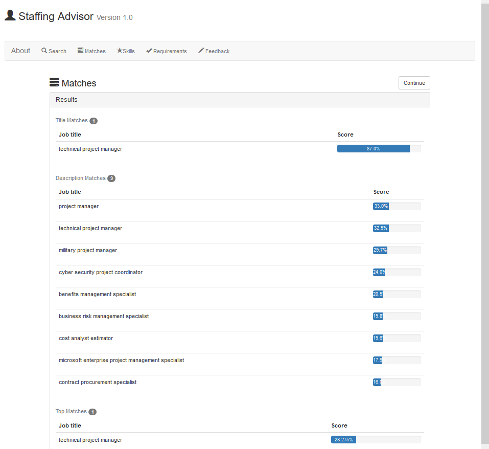
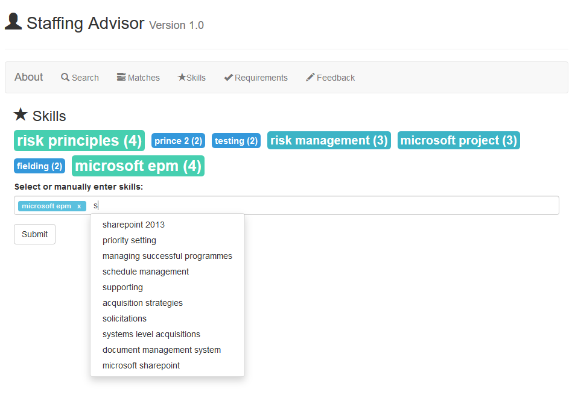
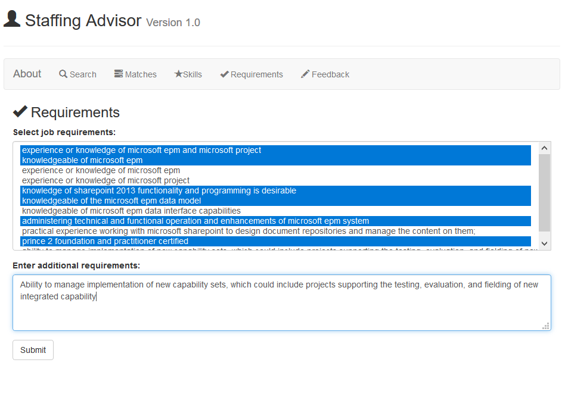
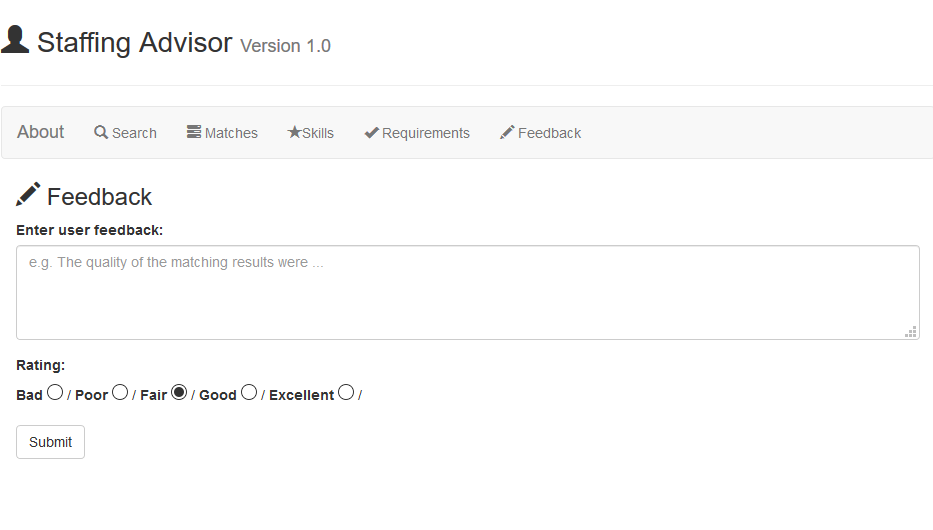

# IBM-NLP-App
This web application is the project result of an internship at IBM. The objective was to develop a matching algorithm that takes in a statement of work (SOW) and outputs fitting job profiles based on a given taxonomy of occupations. The latter was implemented through the combination of fuzzy matching, tf-idf vectors, and cosine similarity. Using the mentioned algorithm, a simple web application was created to showcase its capabilities. Finally, it was deployed to the IBM Cloud.  

## Programming languages and tools
- Python
- Flask web framework
- JavaScript
- HTML
- CSS
- Bootstrap front-end CSS framework 
- GraphQL query language

## Operating principle
1) First, the user is asked to input a SOW which includes a job title, a job description, or both. The text input is then preprocessed in accordance with conventional NLP practices.

2) In the second step, the matching algorithm reads in the user input and determines fitting job profiles based on the underlying occupation taxonomy. As can be seen from the screenshot below, percentual matching scores are provided for the title input as well as the description input.

3) Third, the web application suggests popular skills based on the previous matching results. The user can is able to choose specific skills from a tag cloud. Alternatively, cloud. algorithm reads in the user input and determines fitting job profiles based on the underlying occupation taxonomy. As can be seen from the screenshot below, percentual matching scores are provided for the title input as well as the description input. Alternatively, users can manually enter custom skills into the input field, which also has autocompletion functionality. 

4) Similar to the former step, the users are then asked to input full sentences that elaborate on the previously selected skillset. Users can choose from a recommendation list of such requirements or define their own.

5) Finally, the created SOW along with the matching results are stored in a database through GraphQL. Each user has the option to give feedback according to the functionality of the app. The latter can be used to improve the matching engine or UI elements.

