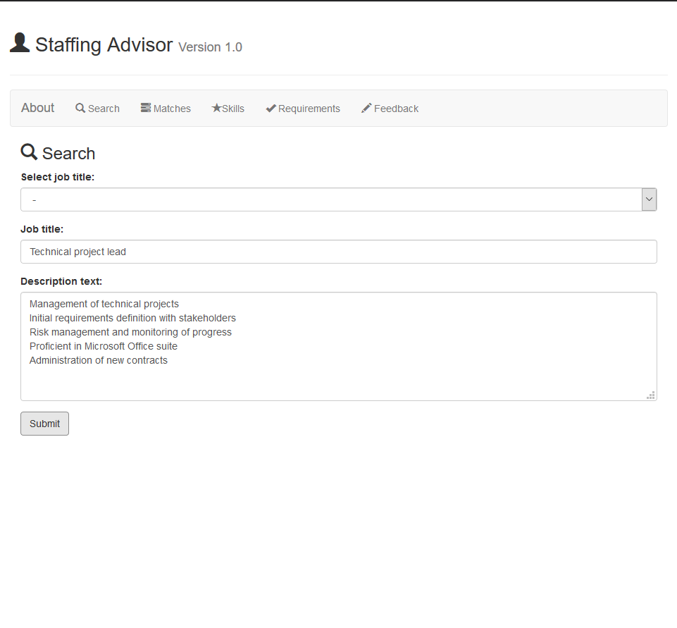
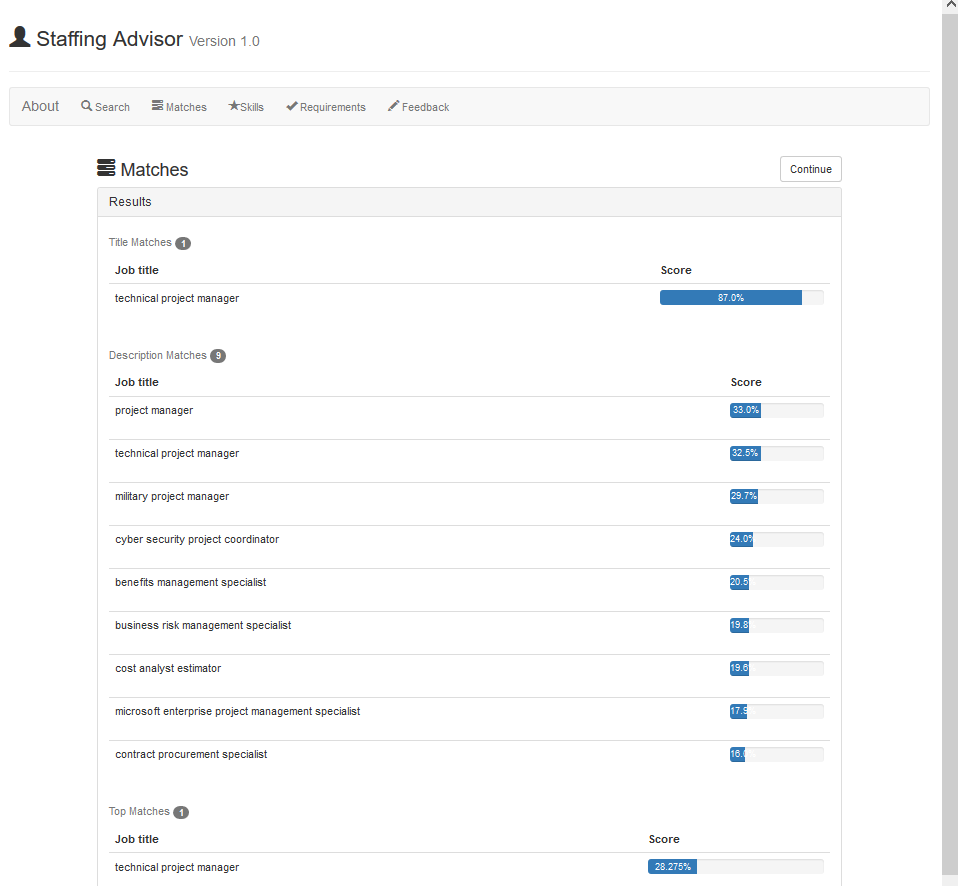

# IBM-NLP-App
This web application is the project result of an internship at IBM. The objective was to develop a matching algorithm that takes in a statement of work (SOW) and outputs fitting job profiles based on a given taxonomy of occupations. The latter was implemented through the combination of fuzzy matching, tf-idf vectors, and cosine similarity. Using the mentioned algorithm, a simple web application was created to showcase its capabilities. Finally, it was deployed to the IBM Cloud.  

## Programming languages and tools
- Python
- Flask web framework
- JavaScript
- HTML
- CSS
- Bootstrap front-end CSS framework 
- GraphQL query language

## Basic functionality
1) First, the user is asked to input a SOW which includes a job title, a job description, or both. The text input is then preprocessed in accordance with conventional NLP practices.

2) In the second step, the user is asked to input a SOW which includes a job title, a job description, or both. The text input is then preprocessed in accordance with conventional NLP practices.

